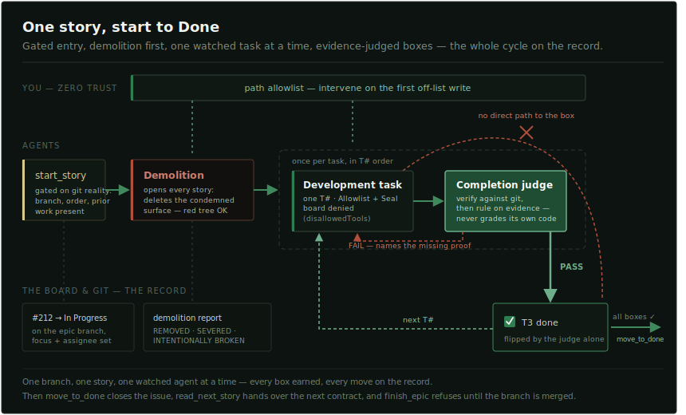
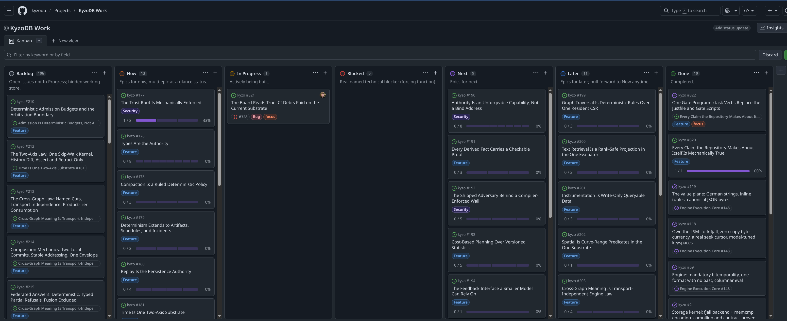
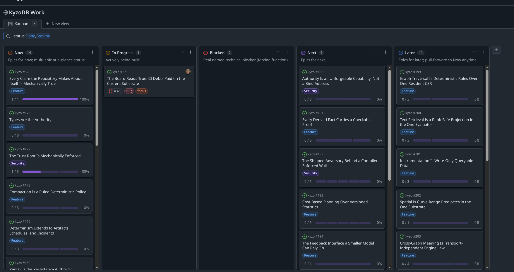
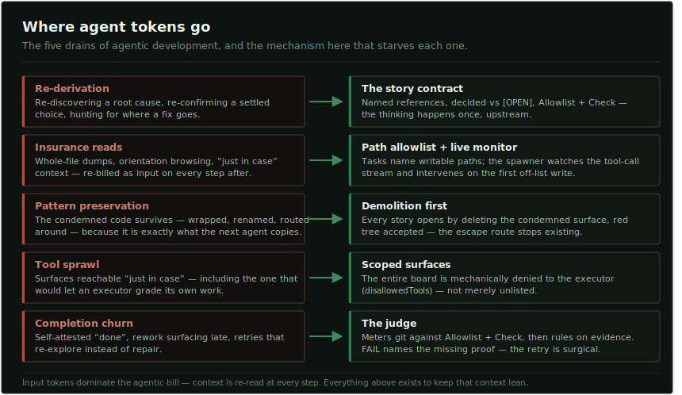
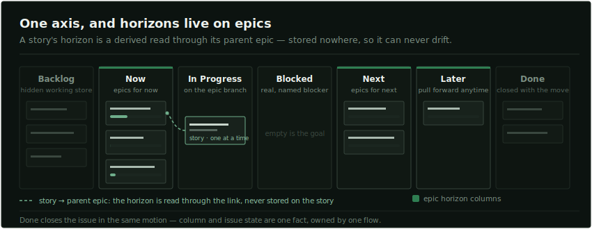
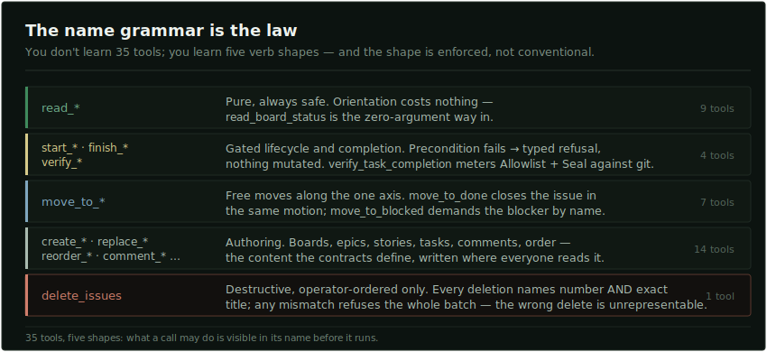
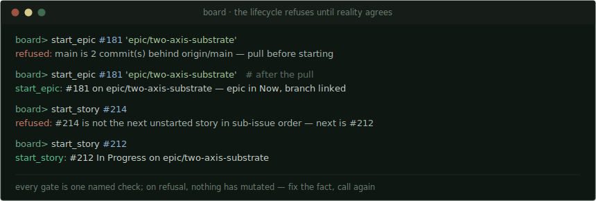

<p align="center">
  
</p>

<h1 align="center">Kyzo Plan</h1>

<p align="center"><em>A GitHub Projects board your agents can be trusted with — typed tools,<br>a lifecycle gated on git, a judge before every checkbox, and a token meter kept lean by design.</em></p>

<p align="center">
  <a href="LICENSE"></a>
  <a href="#install"></a>
  <a href="#install"></a>
  <a href="#a-grammar-not-a-manual"></a>
  <a href="#install"></a>
  <a href="#where-the-tokens-go"></a>
  <a href="#install"></a>
</p>

Kyzo Plan is a control plane for agentic development. The plan lives on a stock
GitHub Projects board — what you see is what your agents operate. They get
**35 typed MCP tools**, contracts that starve re-derivation, and a pipeline where
a checkbox is a fact, not a self-attestation.

<p align="center"></p>

## Install

Requirements: [`uv`](https://docs.astral.sh/uv/) on PATH, `gh` authenticated against
the board's GitHub org, Python 3.12+.

**Claude Code**

```
/plugin marketplace add https://github.com/kyzodb/plan
/plugin install kyzo-plan@kyzo
```

Zero config in the common case: board owner and repo come from `origin`, project
number from the repo's sole open linked GitHub Project. `create_board` provisions
a fresh board with this schema if you're starting from nothing.

Overrides on enable (`/plugin configure kyzo-plan@kyzo`) or at install:

```
claude plugin marketplace add https://github.com/kyzodb/plan
claude plugin install kyzo-plan@kyzo \
  --config board_owner=OWNER --config board_repo=REPO --config board_project=N
```

**Cursor** — same skills, agents, and MCP server. Claude Code is the supported
install from this repository today.

Uninstall with `/plugin uninstall kyzo-plan@kyzo`. Board state lives on GitHub;
uninstalling leaves nothing behind.

## The board is the interface

A real one — the live board [KyzoDB](https://github.com/kyzodb/kyzo) is built on:

<p align="center"></p>

Epics carry roll-up progress (`1 / 3 — 33%`). Classification is the GitHub label.
One card in In Progress answers what is being built right now. Filter `Backlog`
and `Done` away and the working truth fits one screen:

<p align="center"></p>

Nothing custom. Stock GitHub Projects — driven through a surface that keeps it true.

## Where the tokens go

Agentic cost is mostly **input**: context re-read on every step. Five drains, five
mechanisms:

<p align="center"></p>

## One axis, horizons on epics

<p align="center"></p>

## A grammar, not a manual

<p align="center"></p>

The `kyzo-plan-manage-board` skill carries what lives *between* the tools: orient
with `read_board_status`, never work around a refusal, never touch the board
through raw `gh`.

## The lifecycle refuses until reality agrees

<p align="center"></p>

**Branch-per-epic, one story at a time.** `start_epic` demands a clean, up-to-date
`main` and an unused branch. `start_story` demands `HEAD` on that branch, stories
in sub-issue order, and prior work physically present on the branch. `finish_epic`
refuses until every box is checked and the branch has no commit missing from
`main` — it verifies the merge; it never performs it.

## Stories agents can execute

Stories are execution contracts, not tickets. Skills
`kyzo-plan-write-story` and `kyzo-plan-write-epic` hold the full shapes. The
executor-facing spine:

- **Sources / Condemned / Ceiling / Engineering Choice** — what this serves, what
  dies, what was chosen and why.
- **Context** — exact references; open sub-decisions marked `[OPEN]`.
- **Tasks** — append-only `T#` clauses, each with **`Allowlist:`** paths and a
  **`Seal:`** verification command (board state the judge meters against git).
- **Definition of Done** — including the sole seal command as a checked item.

Banned lexicon (*improve, polish, for now…*) stays out of tasks — or lives only
inside Condemned, naming what is being killed.

## Watched at the call

The spawner runs under zero trust: *this agent will deviate; an unwatched
deviation is the spawner's fault.* Paths are law. A live session:

<p align="center"></p>

Orchestration lives in `kyzo-plan-run-story`: allowlist arming, XML spawn, path
watch, stall detection, judge after `verify_task_completion`.

## Built by Kyzo

Kyzo Plan is the system [KyzoDB](https://github.com/kyzodb/kyzo) is built with —
these screenshots are its live board. It does not use or require KyzoDB. We needed
a control plane we could trust with agents; we built it, we run it every day, and
it earned a release of its own.

Next in the line: **Codegraph** — measuring whether each change moves a codebase
toward the architecture its team intends.

## License

Business Source License 1.1 — free to use, modify, and build on for any
non-production purpose; production use requires a commercial license until the
Change Date, after which it converts to MPL-2.0. See [`LICENSE`](LICENSE).
