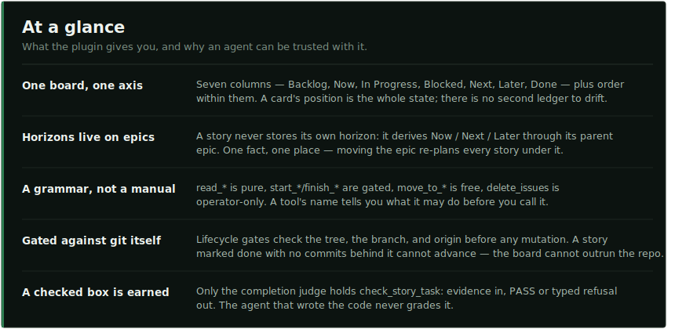
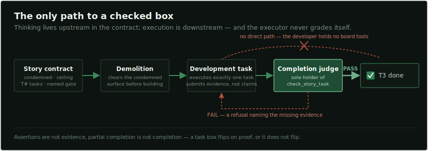

<p align="center">
  
</p>

<h1 align="center">Kyzo Plan</h1>

<p align="center"><em>A GitHub Projects board your agents can be trusted with: typed tools, a lifecycle<br>gated on git reality, a judge between the work and the checkbox — and a token meter kept lean by design.</em></p>

<p align="center">
  <a href="LICENSE"></a>
  <a href="#install"></a>
  <a href="#a-grammar-not-a-manual"></a>
  <a href="#the-token-bill-is-the-product"></a>
  <a href="#install"></a>
</p>

Agentic development did not shrink the planning problem; it moved it — and attached a meter. An
autonomous coding task routinely pushes millions of tokens through the API, most of them **input**:
the same context re-read on every step. Per-seat bills now run to four figures a month, and
[token costs are being compared to payroll](https://www.cio.com/article/4189149/ai-coding-token-costs-are-on-track-to-rival-human-payroll.html).
What runs the meter is rarely the hard thinking. It is waste with a recognizable shape: an agent
re-deriving what was already decided, reading whole files to feel oriented, faithfully preserving
the exact patterns it was sent in to replace, wandering off the one task it was handed, and
grading its own work so the rework surfaces late.

Kyzo Plan is a control plane built to starve that waste. It keeps the state of work in the one
place you and your agents read without translation — a GitHub Projects board. Not a mirror of the
plan: **the plan.** You read it as a kanban board with roll-up progress bars; your agents operate
it as 33 typed MCP tools inside Claude Code, through contracts, gates, and scoped surfaces that
make the cheap path and the correct path the same path:

<p align="center"></p>

## The token bill is the product

Input tokens dominate agentic cost because context is re-consumed at every step — so the way to
cut the bill is not a cheaper model, it is an executor that never acquires what it doesn't need.
Every mechanism in this plugin answers to that one P&L. Five drains, five mechanisms:

<p align="center"></p>

## Watched at the call, not the retrospective

The development agent's charter puts its spawner under zero trust — *this agent will deviate; an
unwatched deviation is the spawner's fault* — so the spawner tails the live tool-call stream, one
event per call, and judges each read and edit as it lands. Here is a real session: the
orchestrator narrating per-call verdicts over a running task agent, catching a self-inflicted
clobber the moment it happens, auditing the evidence phase in parallel, and spending a handful of
tokens to do it:

<p align="center"></p>

The executor's side of the same bargain is the stance its charter opens with: declare your
acquisitions before the first tool call, tie each read to the output it feeds, re-check mutable
state freely, and treat a read that feeds no output as the failure mode. Between the stance below
and the monitor above, the token budget is managed at the call — never discovered on the invoice.

## The board is the interface

Here is a real one — the live board [KyzoDB](https://github.com/kyzodb/kyzo) is built on:

<p align="center"></p>

Every card carries its signal on its face. An epic shows its stories as a roll-up progress bar
(`1 / 3 — 33%`), classification is the GitHub label itself (`Feature`, `Bug`, `Security`, …), and
the single card in In Progress answers "what is being worked on right now" — with the issue link,
the branch, and the assignee GitHub already renders. Because stories hang under their epics as
sub-issues, the horizon columns hold only epics, yet nothing is hidden: the progress bar *is* the
stories, rolled up.

Day to day, filter `Backlog` and `Done` away and the board collapses to the working truth — the
whole plan in one screen:

<p align="center"></p>

Nothing here is a custom frontend. It is stock GitHub Projects — visible to anyone you'd show the
repo to, rendered by the tool your team already has open — driven through a surface that keeps it
true.

## One axis, and horizons live on epics

The model has exactly one moving part: which column a card is in, and where it sits within it.
`Now`, `Next`, and `Later` are **horizons**, and horizons belong to epics alone. A story never
stores its own — its horizon is a derived read through its parent epic. That is not a convention
the tools hope you follow; it is the only representable state. There is no field on a story to set,
so a story's schedule and its epic's schedule cannot disagree.

<p align="center"></p>

Order is state too: an epic's sub-issue order **is** its execution order, and card order within a
horizon is priority. Re-planning is therefore one move — pull an epic from `Later` to `Now` and
every story under it just re-planned, with nothing to update and nothing left behind to contradict
it.

## A grammar, not a manual

Thirty-three tools sounds like a manual. It isn't — the surface is an ontology, and a tool's name
tells you its powers before you call it:

<p align="center"></p>

Each tool's description is its documentation, so an agent doesn't study a reference — it reads the
schema it was about to call anyway. The `kyzo-plan-manage-board` skill carries the little that
lives *between* the tools: orient with `read_board_status` before acting, never work around a
refusal, never touch the board through raw `gh`.

## The lifecycle refuses until reality agrees

The gated verbs are where this stops being a nicer issue tracker. `start_epic`, `start_story`, and
`finish_epic` run deterministic checks against **git itself** before any mutation, and every failed
check is a typed refusal that names the one fact to fix:

<p align="center"></p>

The discipline the gates enforce is **branch-per-epic, one story at a time**:

- `start_epic` demands a clean tree on an up-to-date `main`, an unused branch name, and no other
  epic still in flight — then creates the branch, links it to the epic, and pulls the epic into
  `Now`. Epics never enter In Progress; that column belongs to the one active story.
- `start_story` demands `HEAD` on the epic's branch and stories taken in sub-issue order. It also
  demands that the *preceding* story's work physically exists: a story checked off with no commits
  behind it on the branch refuses the next start. The board cannot outrun the repository.
- `finish_epic` closes the loop: every story Done with every box checked, and the epic branch
  carrying no commit missing from `main`. Merging is git work it verifies but never performs —
  your merge strategy stays yours.

Most tools take an optional `target`, so one session can operate several boards; the git gates
always bind to the repository you are actually standing in.

## Stories an agent can execute without re-deriving

The most expensive failure in agent-driven development is not a wrong line of code — it is an agent
re-deriving what was already decided: re-discovering a root cause the author knew, re-confirming a
settled choice, exploring a codebase for a location the story could simply have named. The
exploration reads as diligence and burns tokens by the million.

The story format this plugin ships is built to starve that failure. It is not a ticket template —
it is an execution contract, written once, upstream, by whoever is thinking:

- **Sources** — the authorities this story serves, each with its asserted property.
- **Condemned** — the old path this story kills, why, and the test that proves it stayed dead. The
  demolition agent acts on this block; vague means nothing can be safely deleted.
- **Ceiling** — a `Maximum | Chosen | Constraint` table. Committing below the maximum the sources
  assert requires a *named, measured* constraint — "pragmatism" doesn't parse.
- **Engineering Choice** — the hard commitment, its type, and its consequence. Restated
  uncertainty is not a decision.
- **Context** — exact references (`file`, module, spec) the executor works against, with every
  genuinely open sub-decision marked `[OPEN]` and owned, so improvisation has nowhere to hide.
- **Tasks** — append-only `T#` identifiers, one clause each: the handles the judge checks off.
- **Definition of Done** — including the one item that names the exact verification gate command.
  If you cannot name how done is checked, the story is not sharp enough to execute.

The `kyzo-plan-write-story` and `kyzo-plan-write-epic` skills hold the full contracts,
down to a banned lexicon: mood verbs (*improve, polish, clean up*) cannot appear in tasks, and
escape hatches (*for now, fall back, phase 2*) can appear only inside the Condemned block — naming
the thing being killed.

## The only path to a checked box

Executing a story is a pipeline of three agents with deliberately unequal powers:

<p align="center"></p>

- **`kyzo-plan-demolition`** opens every story: it reads the Condemned block and deletes the old
  surface before construction begins — the files, symbols, and escape routes that would otherwise
  survive wrapped, renamed, or routed around, because the old code is exactly what the next agent
  would copy. It accepts a red tree; a preserved fallback is the failure.
- **`kyzo-plan-development-task`** executes exactly one `T#` task. The entire board surface is
  **mechanically denied** to it (`disallowedTools`, not a convention), it does not re-derive, and
  when it believes it is done, all it can do is submit a completion form.
- **`kyzo-plan-task-completion-judge`** is the sole holder of `check_story_task`. It writes no
  code and performs no courtesy review: it rules on submitted evidence against the story contract,
  actively suspicious, burden of proof on the developer. PASS checks the box; FAIL returns a
  refusal naming the missing evidence.

The separation is the point: the agent that wrote the code cannot grade it, and a checkbox on this
board is therefore a *fact* — which is exactly what makes the roll-up progress bars worth reading.

And the top of the pipeline is you. Every move is a board event with an author, and every checked
box carries the evidence that earned it — so you watch the cards move, see who moved them, inspect
the proof behind any decision, and intervene while a bad behavior is still a tool call, before it
hardens into a merged pull request or a token bill.

## Install

Requirements: [`uv`](https://docs.astral.sh/uv/) on PATH, `gh` authenticated against the board's
GitHub org, Python 3.12+.

In Claude Code, from a clone (or the repo URL once hosted):

```
/plugin marketplace add /path/to/plan
/plugin install kyzo-plan@kyzo
```

Zero config in the common case: the board defaults to the checkout — owner and repo from the
`origin` remote, project number from the repo's sole open linked GitHub Project. `create_board`
provisions a new board carrying this schema (columns, labels, and descriptions) if you're starting
from nothing.

To target a different board, set the overrides on enable (`/plugin configure kyzo-plan@kyzo`) or
at install time:

```
claude plugin marketplace add /path/to/plan
claude plugin install kyzo-plan@kyzo \
  --config board_owner=OWNER --config board_repo=REPO --config board_project=N
```

When neither config nor a derivable default exists (no origin remote, zero or several open linked
projects), the server refuses to start and names exactly what to set — the same typed-refusal
manner as everything else here.

Uninstall with `/plugin uninstall kyzo-plan@kyzo`. Board state lives entirely on GitHub;
uninstalling leaves nothing behind.

## The first tool out of Kyzo

Kyzo Plan is the system [KyzoDB](https://github.com/kyzodb/kyzo) is built with — the screenshots
above are its live board, and the taste for typed refusals and gated mutations is the same taste
that put seven numbered laws at the front door of that engine. It does not use or require KyzoDB —
yet — and needs nothing but `gh` and `uv`: we built it because we needed it, we run it every day,
and it turned out to be worth contributing on its own.

It is also the first of a line. The next tool, **Codegraph**, is being prototyped on KyzoDB now:
it measures whether each change moves a codebase toward the architecture its team actually
intends — or away from it. If a database whose every answer can be replayed, explained, or refused
sounds like your kind of thing, you know where the board came from.

## License

Business Source License 1.1 — free to use, modify, and build on for any non-production purpose;
production use requires a commercial license until the Change Date, after which it converts to
MPL-2.0. See [`LICENSE`](LICENSE).
